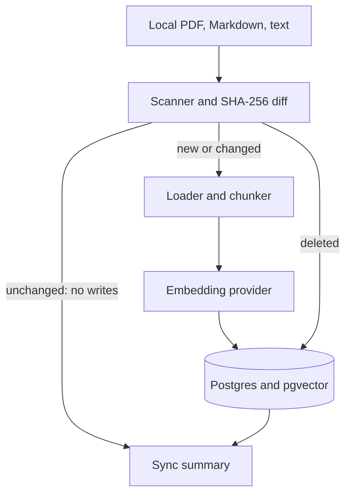

# ragpipe

`ragpipe` is the data pipeline underneath a RAG system. It keeps PostgreSQL/pgvector synchronized
with a changing folder of PDF, Markdown, and text documents. It detects additions, modifications,
and deletions using SHA-256 content hashes, embeds only affected chunks, and leaves unchanged data
alone.

> Everyone builds the chatbot on top. This project builds the pipeline underneath—the part that
> must stay correct when a document changes, disappears, or thousands arrive overnight.

## What is implemented

- Recursive local-folder discovery for `.pdf`, `.md`, `.markdown`, and `.txt`; symlinks ignored
- Content-hash change detection rather than unreliable modification timestamps
- Recursive character chunking with configurable size and overlap
- A provider interface plus local `sentence-transformers/all-MiniLM-L6-v2` embeddings
- PostgreSQL metadata and pgvector embeddings, with foreign-key cascade deletion
- One atomic transaction per sync and rollback on failure
- Idempotent no-op synchronization for unchanged files
- `ragpipe sync` and `ragpipe status` commands
- JSON structured operational logs and persisted sync-run statistics
- Unit tests for new/changed/deleted/unchanged detection, encoding, chunking, idempotency, and deletes
- Docker Compose, package metadata, type/lint configuration, and GitHub Actions CI

Chat/answer generation, a web UI, authentication, and multi-tenancy are intentionally outside v0.1.

## Architecture



The pipeline reads prior state, computes a deterministic diff, then applies deletes and replacements
inside one database transaction. A changed path's old document cascades to all old chunks before its
replacement is inserted. Any loader, embedding, or database failure rolls the transaction back.

## Quick start

Requirements: Docker with Compose, Python 3.12+, and enough disk/RAM to download and run the local
embedding model once.

```bash
cp .env.example .env
docker compose up -d
python -m venv .venv
source .venv/bin/activate
pip install -e '.[local,dev]'
ragpipe sync --source ./sample_docs
ragpipe sync --source ./sample_docs  # embedded_chunks must be 0
ragpipe status
```

To demonstrate updates, edit `sample_docs/welcome.md` and sync; only that document is embedded.
Delete it and sync; its document row and vectors are removed.

## Configuration

All settings use the `RAGPIPE_` prefix and can be placed in `.env`.

| Setting | Default | Purpose |
|---|---:|---|
| `DATABASE_URL` | local `ragpipe` Postgres | psycopg connection URL |
| `EMBEDDING_MODEL` | `all-MiniLM-L6-v2` | sentence-transformer model |
| `EMBEDDING_DIMENSION` | `384` | pgvector column dimension; must match model |
| `CHUNK_SIZE` | `800` | maximum target characters per chunk |
| `CHUNK_OVERLAP` | `120` | context repeated across adjacent chunks |
| `BATCH_SIZE` | `64` | texts passed to the embedder per call |
| `LOG_LEVEL` | `INFO` | structured log threshold |

Changing the embedding model or its dimension requires a fresh database/explicit migration because
stored vectors from different embedding spaces are not comparable. In production, use a secret
manager for the database password, restrict network access, enable TLS, back up PostgreSQL, pin image
digests, and deploy one synchronizer per source to avoid concurrent ownership conflicts.

## Development and verification

```bash
make install
make check
make build
```

The most important test runs the full pipeline twice and verifies the second run performs no
embedding and no document/chunk writes. A separate test proves source deletion removes every chunk.

## Extension points

Implement `EmbeddingProvider` to add OpenAI/Cohere or implement `Chunker` for semantic splitting.
Object-store scanners can feed the same `ScannedDocument`/`SourceDiff` contract. v0.2 can add
metadata filters/access control, retrieval evaluation, cloud sources, and Prometheus/OpenTelemetry.

## Operational limitations

- v0.1 owns one database corpus and local source root; multi-source tenancy is not implemented.
- The schema is created safely on startup, but production schema evolution should use Alembic.
- Empty documents are tracked but create no chunks.
- Scanned paths are relative to the selected root; moving a file is modeled as delete plus add.
- Concurrent syncs against the same corpus are not supported in v0.1; orchestrators should enforce
  a single active run.

## License

MIT

