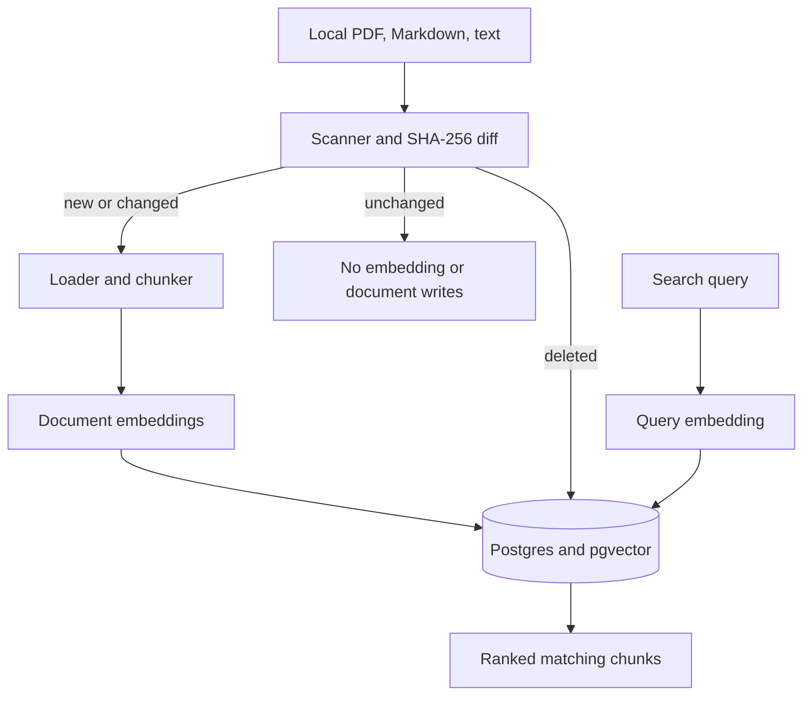

# ragpipe

`ragpipe` is the data pipeline underneath a RAG system. It keeps PostgreSQL/pgvector synchronized with a changing folder of PDF, Markdown, and text documents. It detects additions, modifications, and deletions using SHA-256 content hashes, embeds only affected chunks, and leaves unchanged data alone.

> Everyone builds the chatbot on top. This project builds the pipeline underneath—the part that must stay correct when a document changes, disappears, or thousands arrive overnight.

## What is implemented

* Recursive local-folder discovery for `.pdf`, `.md`, `.markdown`, and `.txt`; symlinks ignored
* Content-hash change detection rather than unreliable modification timestamps
* Recursive character chunking with configurable size and overlap
* A provider interface plus local `sentence-transformers/all-MiniLM-L6-v2` embeddings
* PostgreSQL metadata and pgvector embeddings with foreign-key cascade deletion
* One atomic transaction per sync with rollback on failure
* Persisted, credential-sanitized failed-run information
* Idempotent no-op synchronization for unchanged files
* PostgreSQL advisory locking that rejects overlapping synchronization runs
* `ragpipe sync`, `ragpipe search`, and `ragpipe status` commands
* Cosine-similarity retrieval with embedding-model filtering and deterministic ranking
* PostgreSQL HNSW cosine index for scalable nearest-neighbor search
* JSON structured operational logs and persisted sync-run statistics
* Unit and pgvector integration tests covering synchronization, rollback, locking, migrations, and vector search
* Docker Compose, package metadata, type/lint configuration, and GitHub Actions CI

Chat/answer generation, a web UI, authentication, and multi-tenancy are intentionally outside the current scope.

## Architecture



The pipeline reads prior state, computes a deterministic diff, then applies deletes and replacements inside one database transaction. A changed path’s old document cascades to all old chunks before its replacement is inserted. Any loader, embedding, or database failure rolls the transaction back.

Search embeds the query with the configured model and compares it only with chunks created by that same model.

## Quick start

Requirements: Docker with Compose, Python 3.12+, and enough disk and RAM to download and run the local embedding model.

```bash
cp .env.example .env
docker compose up -d

python -m venv .venv
source .venv/bin/activate

pip install -e '.[local,dev]'
alembic upgrade head

ragpipe sync --source ./sample_docs
ragpipe sync --source ./sample_docs
ragpipe status
ragpipe search --query "What is Ragpipe?" --limit 5
```

The second unchanged synchronization should report:

```text
embedded_chunks: 0
```

To demonstrate updates, edit `sample_docs/welcome.md` and synchronize again. Only that document should be embedded. Delete the file and synchronize again to remove its document row and vectors.

The local embedding model is downloaded on first use and then loaded from the local Hugging Face cache. An optional `HF_TOKEN` environment variable enables authenticated downloads and higher rate limits. Never commit this token to the repository.

## Configuration

All Ragpipe settings use the `RAGPIPE_` prefix and can be placed in `.env`.

| Setting                       |                                  Default | Purpose                                  |
| ----------------------------- | ---------------------------------------: | ---------------------------------------- |
| `RAGPIPE_DATABASE_URL`        |               Local `ragpipe` PostgreSQL | psycopg connection URL                   |
| `RAGPIPE_EMBEDDING_MODEL`     | `sentence-transformers/all-MiniLM-L6-v2` | Embedding model                          |
| `RAGPIPE_EMBEDDING_DIMENSION` |                                    `384` | pgvector dimension; must match the model |
| `RAGPIPE_CHUNK_SIZE`          |                                    `800` | Maximum target characters per chunk      |
| `RAGPIPE_CHUNK_OVERLAP`       |                                    `120` | Context repeated across adjacent chunks  |
| `RAGPIPE_BATCH_SIZE`          |                                     `64` | Texts passed to the embedder per call    |
| `RAGPIPE_LOG_LEVEL`           |                                   `INFO` | Structured logging threshold             |

Changing the embedding model or dimension requires explicitly rebuilding or migrating the stored corpus. Vectors produced by different models belong to different embedding spaces and are not directly comparable.

For production, use a secret manager for database credentials, restrict network access, enable TLS, back up PostgreSQL, and pin container image digests.

## Vector search

Search the synchronized corpus without adding an LLM or chatbot layer:

```bash
ragpipe search \
  --query "How are document updates handled?" \
  --limit 5
```

Each result contains:

* Document path
* Chunk index
* Chunk content
* Chunk metadata
* Embedding model
* Cosine-similarity score

Higher scores indicate closer vector similarity. The score is a ranking signal, not a probability or confidence percentage.

Search only compares chunks produced by the configured embedding model. Vectors from different models are filtered because their embedding spaces are not comparable. The result limit must be between `1` and `100`.

Search uses PostgreSQL’s HNSW index with `vector_cosine_ops`. It can safely run while synchronization is in progress and sees the last committed corpus through PostgreSQL transaction isolation.

## Database migrations

Alembic is the only owner of the Ragpipe PostgreSQL schema. The application validates the installed revision and vector dimension during startup but never creates or modifies tables automatically.

Apply all pending migrations:

```bash
alembic upgrade head
```

Check the installed revision:

```bash
alembic current
```

Check the latest revision available in the code:

```bash
alembic heads
```

Vector search requires revision:

```text
0002_vector_search_index
```

This migration adds the HNSW cosine index without rebuilding existing document embeddings.

## Concurrent synchronization

Ragpipe uses a PostgreSQL advisory lock to allow only one synchronization per database at a time. This prevents overlapping cron jobs or deployments from reading the same corpus state and applying conflicting changes.

A rejected concurrent attempt exits with code `3`. It does not scan documents, generate embeddings, modify the corpus, or create a failed-run record.

The lock is automatically released when synchronization finishes or its PostgreSQL session closes. An orchestrator can safely retry a rejected run later.

Search commands do not acquire this lock because they only read the last committed corpus.

## Failure handling

Document and vector changes are committed atomically. If loading, chunking, embedding, or database writing fails, the complete synchronization transaction is rolled back.

A separate failed-run record is then stored with a bounded, credential-sanitized error message. This preserves operational visibility without leaving a partially updated corpus.

## CLI exit codes

| Code | Meaning                                                     |
| ---: | ----------------------------------------------------------- |
|  `0` | Command completed successfully                              |
|  `1` | Synchronization or search failed                            |
|  `2` | Database schema is missing, outdated, or incompatible       |
|  `3` | Another synchronization already owns the database sync lock |

## Development and verification

Install development dependencies:

```bash
make install
```

Run formatting, linting, type checking, and tests:

```bash
make check
```

Build the source distribution and wheel:

```bash
make build
```

The test suite includes:

* New, changed, deleted, and unchanged document detection
* Idempotent repeated synchronization
* Changed-document replacement
* Deleted-document cleanup
* Transaction rollback
* Failed-run persistence
* Concurrent synchronization rejection
* Migration upgrade and downgrade
* Cosine ranking
* Embedding-model filtering
* Search limits and validation
* HNSW index verification
* CLI output and exit codes

## Extension points

Implement `EmbeddingProvider` to add another local model or an API provider such as OpenAI or Cohere. Implement `Chunker` to add semantic or document-aware splitting.

Object-store scanners can feed the same `ScannedDocument` and `SourceDiff` contracts. Future releases can add metadata filters, access control, retrieval evaluation, cloud sources, and Prometheus/OpenTelemetry metrics.

## Operational limitations

* The current version owns one database corpus and one local source root; multi-source tenancy is not implemented.
* Alembic migrations must be applied before running a newer application version.
* Empty documents are tracked but create no chunks.
* Scanned paths are relative to the selected root; moving a file is modeled as a deletion plus an addition.
* Synchronizations are serialized through a database advisory lock; rejected attempts must be retried.
* HNSW search is approximate and optimized for scalable nearest-neighbor retrieval.
* Search returns stored chunk content directly and does not implement user authorization or metadata-based access control.
* Changing the embedding model does not automatically re-embed unchanged documents.

## License

MIT
