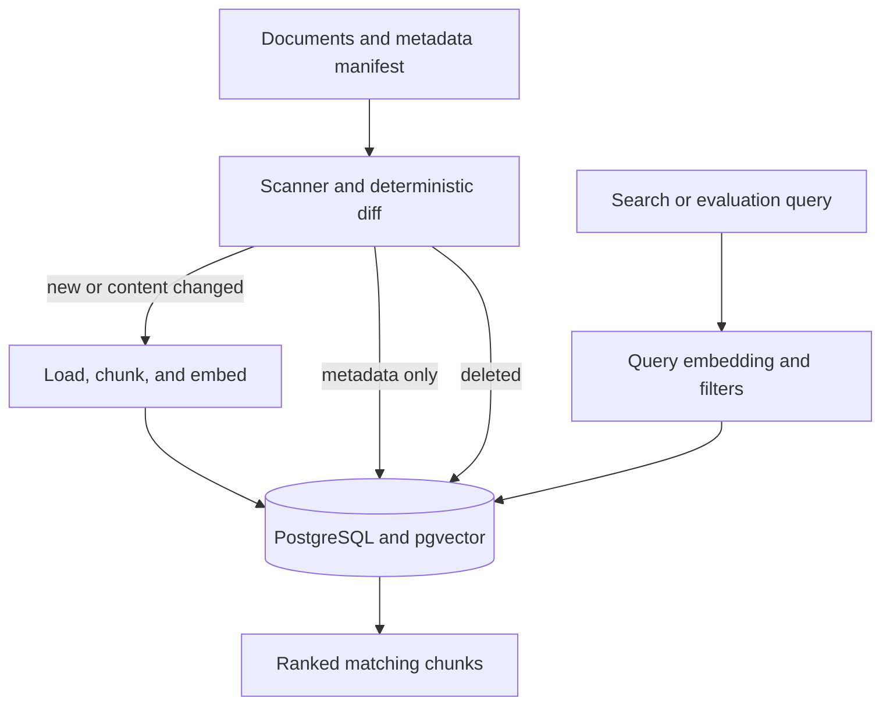

# ragpipe

`ragpipe` is the data pipeline underneath a retrieval-augmented generation (RAG) system. It keeps PostgreSQL and pgvector synchronized with a changing folder of PDF, Markdown, and text documents. It detects additions, content changes, metadata changes, and deletions using deterministic SHA-256 hashes, then embeds only the chunks that actually need new vectors.

> Everyone builds the chatbot on top. This project builds the pipeline underneath—the part that must stay correct when a document changes, disappears, or thousands arrive overnight.

## What is implemented

- Recursive local-folder discovery for `.pdf`, `.md`, `.markdown`, and `.txt`; document symlinks are ignored
- SHA-256 content and metadata change detection instead of unreliable modification timestamps
- Optional per-document metadata through `.ragpipe-metadata.json`
- Metadata-only updates without deleting chunks or regenerating embeddings
- Recursive character chunking with configurable size and overlap
- A provider interface plus local `sentence-transformers/all-MiniLM-L6-v2` embeddings
- PostgreSQL document state and pgvector embeddings with foreign-key cascade deletion
- One atomic database transaction per synchronization with rollback on failure
- Persisted, bounded, credential-sanitized failed-run information
- Idempotent no-op synchronization for unchanged files
- PostgreSQL advisory locking that rejects overlapping synchronization runs
- `ragpipe sync`, `ragpipe search`, `ragpipe evaluate`, and `ragpipe status` commands
- Cosine-similarity retrieval with embedding-model and JSONB metadata filtering
- Deterministic result ordering for equal similarity scores
- PostgreSQL HNSW cosine index for vector search
- PostgreSQL GIN index for document-metadata containment filters
- JSONL retrieval evaluation with Hit Rate@K, MRR@K, and per-query ranks
- Structured JSON operational logs and persisted synchronization statistics
- Unit and pgvector integration tests covering synchronization, metadata, rollback, locking, migrations, search, and evaluation
- Docker Compose, package metadata, linting, type checking, coverage enforcement, builds, and GitHub Actions CI

Chat/answer generation, a web UI, authentication, authorization, and multi-tenancy are intentionally outside the current scope.

## Architecture



The scanner compares the current source with the document state stored in PostgreSQL. The synchronization pipeline then applies the calculated changes inside one database transaction.

| Detected state | Database action | Generate embeddings? |
| --- | --- | ---: |
| New document | Insert document and chunks | Yes |
| Content changed | Replace the document and its chunks | Yes |
| Metadata only changed | Update the existing document row | No |
| Document deleted | Delete the document; chunks cascade | No |
| Unchanged | No document or chunk write | No |

A changed path's old document cascades to all old chunks before its replacement is inserted. Any loader, chunking, embedding, or database failure rolls back the complete corpus change.

Search embeds the query with the configured model and compares it only with chunks created by the same model. Evaluation sends expected query-to-document matches through that same retrieval path.

## Quick start

Requirements:

- Docker with Compose
- Python 3.12 or newer
- Enough disk and RAM to download and run the local embedding model

```bash
cp .env.example .env
docker compose up -d

python -m venv .venv
source .venv/bin/activate

pip install -e '.[local,dev]'
alembic upgrade head

ragpipe sync --source ./sample_docs
ragpipe sync --source ./sample_docs
ragpipe status

ragpipe search \
  --query "What is Ragpipe?" \
  --limit 5

ragpipe search \
  --query "What is Ragpipe?" \
  --metadata '{"department":"engineering"}'

ragpipe evaluate \
  --dataset evaluation/sample.jsonl \
  --k 5
```

The second unchanged synchronization should report:

```json
{
  "unchanged_documents": 1,
  "embedded_chunks": 0,
  "metadata_changed_documents": 0
}
```

To demonstrate content updates, edit `sample_docs/welcome.md` and synchronize again. Only that document should be embedded. Delete the document and its corresponding manifest entry, then synchronize again to remove its document row and vectors.

The local embedding model is downloaded on first use and then loaded from the local Hugging Face cache. An optional `HF_TOKEN` environment variable enables authenticated downloads and higher rate limits. Never commit that token.

## Configuration

All Ragpipe settings use the `RAGPIPE_` prefix and can be placed in `.env`.

| Setting | Default | Purpose |
| --- | ---: | --- |
| `RAGPIPE_DATABASE_URL` | Local `ragpipe` PostgreSQL | psycopg connection URL |
| `RAGPIPE_EMBEDDING_MODEL` | `sentence-transformers/all-MiniLM-L6-v2` | Embedding model |
| `RAGPIPE_EMBEDDING_DIMENSION` | `384` | pgvector dimension; must match the model |
| `RAGPIPE_CHUNK_SIZE` | `800` | Maximum target characters per chunk |
| `RAGPIPE_CHUNK_OVERLAP` | `120` | Context repeated across adjacent chunks |
| `RAGPIPE_BATCH_SIZE` | `64` | Texts passed to the embedder per call |
| `RAGPIPE_LOG_LEVEL` | `INFO` | Structured logging threshold |

Changing the embedding model or dimension requires explicitly rebuilding or migrating the stored corpus. Vectors produced by different models belong to different embedding spaces and are not directly comparable.

For production, use a secret manager for database credentials, restrict network access, enable TLS, back up PostgreSQL, and pin container image digests.

## Document metadata

Place an optional `.ragpipe-metadata.json` file at the root of the synchronized source directory. Its keys are document paths relative to that root, and every value must be a JSON object.

```json
{
  "welcome.md": {
    "department": "engineering",
    "tags": ["demo", "rag"],
    "access_groups": ["developers"]
  },
  "handbook/leave.md": {
    "department": "hr",
    "region": "india",
    "tags": ["policy", "leave"]
  }
}
```

The manifest itself is configuration and is not ingested as a document.

Manifest validation is intentionally strict:

- The manifest must be a regular, non-symlink file no larger than 1 MiB.
- Its root value must be a JSON object.
- Every key must be a safe POSIX-style relative path.
- Absolute paths, parent traversal such as `../`, and unsupported paths are rejected.
- Every manifest path must refer to a supported document discovered in the same source.
- Every document's metadata must be a JSON object.
- Metadata is canonically serialized before hashing, so changing JSON key order does not create a false update.

If a document is deleted, remove its manifest entry in the same change. A stale entry referencing a missing document causes synchronization to fail safely.

When only metadata changes, Ragpipe updates `documents.metadata` and `documents.metadata_hash` without replacing the document, deleting chunks, or calling the embedding provider. The synchronization result reports the change separately:

```json
{
  "changed_documents": 0,
  "metadata_changed_documents": 1,
  "embedded_chunks": 0,
  "deleted_chunks": 0
}
```

## Vector search

Search the synchronized corpus without adding an LLM or chatbot layer:

```bash
ragpipe search \
  --query "How are document updates handled?" \
  --limit 5
```

Each result contains:

- Document path
- Chunk index
- Chunk content
- Merged document and chunk metadata
- Embedding model
- Cosine-similarity score

Higher scores indicate closer vector similarity. A score is a ranking signal, not a probability or confidence percentage.

Search only compares chunks produced by the configured embedding model. The result limit must be between `1` and `100`.

The schema provides an HNSW index using `vector_cosine_ops` for scalable approximate nearest-neighbor search. PostgreSQL may choose an exact sequential scan for very small corpora.

Search can run while synchronization is in progress. PostgreSQL transaction isolation ensures it sees the last committed corpus rather than a partial update.

### Metadata filters

Pass a JSON object to `--metadata` or `-m`:

```bash
ragpipe search \
  --query "leave policy" \
  --limit 5 \
  --metadata '{"department":"hr"}'
```

Multiple fields can be required together:

```bash
ragpipe search \
  --query "leave policy" \
  --metadata '{"department":"hr","region":"india"}'
```

PostgreSQL JSONB containment is used, so array containment is supported:

```bash
ragpipe search \
  --query "leave policy" \
  --metadata '{"tags":["leave"]}'
```

The filter must be valid JSON and its top-level value must be an object. Arrays, strings, numbers, booleans, `null`, `NaN`, and infinity values are rejected as top-level filters. An empty object matches all document metadata.

Document metadata is merged with internal chunk metadata in each result. If both contain the same key, chunk metadata takes precedence. Avoid document metadata keys reserved for chunk-level information, such as `chunk_index`.

The `documents_metadata_gin_idx` GIN index supports JSONB containment filtering.

> Metadata filtering is not authentication or authorization. An application handling protected documents must authenticate the caller, derive allowed filters from trusted identity data, enforce them server-side, and fail closed. Do not allow a caller to select their own `access_groups` value and treat that as access control.

## Retrieval evaluation

Ragpipe can measure whether search retrieves an expected document for a set of test queries.

Evaluation datasets use JSON Lines format with one case per line:

```json
{"query": "What does the demo document demonstrate?", "expected_document": "welcome.md"}
{"query": "What should happen after editing a document?", "expected_document": "welcome.md"}
```

`expected_document` must exactly match the document path relative to the synchronized source root.

Run an evaluation:

```bash
ragpipe evaluate \
  --dataset evaluation/sample.jsonl \
  --k 5
```

The report includes:

- `total_cases`: number of evaluated queries
- `hits`: queries where the expected document appeared
- `hit_rate_at_k`: fraction of queries with the expected document in the top K chunks
- `mean_reciprocal_rank_at_k`: average reciprocal rank of the first matching chunk
- Per-query retrieved paths, rank, reciprocal rank, and hit status

If the expected document appears first, its reciprocal rank is `1.0`; second is `0.5`; absent from the top K is `0.0`.

Queries are embedded in batches using `RAGPIPE_BATCH_SIZE`, then searched independently. The included sample is a smoke test, not a meaningful production benchmark. A useful evaluation corpus should contain multiple documents, varied queries, difficult negatives, and expected documents at different ranks.

## Database migrations

Alembic is the only owner of the Ragpipe PostgreSQL schema. The application validates the installed revision and vector dimension during startup but never creates or changes tables automatically.

Apply pending migrations before running the application:

```bash
alembic upgrade head
```

Inspect migration state:

```bash
alembic current
alembic heads
alembic history
```

Relevant revisions:

| Revision | Purpose |
| --- | --- |
| `0001_initial_schema` | Documents, chunks, sync runs, and pgvector schema |
| `0002_vector_search_index` | HNSW cosine index for vector retrieval |
| `0003_document_metadata` | Document metadata, metadata hashes, and metadata-change statistics |
| `0004_document_metadata_index` | GIN `jsonb_path_ops` index for metadata containment filters |

The application currently requires `0004_document_metadata_index` at startup.

## Concurrent synchronization

Ragpipe uses a PostgreSQL advisory lock to allow only one synchronization per database at a time. This prevents overlapping cron jobs or deployments from reading the same corpus state and applying conflicting changes.

A rejected concurrent attempt exits with code `3`. It does not scan documents, generate embeddings, modify the corpus, or create a failed-run record. The lock is automatically released when synchronization finishes or its PostgreSQL session closes, so an orchestrator can retry later.

Search and evaluation do not acquire this lock because they only read the last committed corpus.

## Failure handling

Document, metadata, and vector changes are committed atomically. If scanning, loading, chunking, embedding, or database writing fails, the synchronization transaction is rolled back.

A separate failed-run record is then stored with a bounded, credential-sanitized error message. This preserves operational visibility without leaving a partially updated corpus.

Search and evaluation errors are returned as structured JSON and do not modify the corpus.

## CLI exit codes

| Code | Meaning |
| ---: | --- |
| `0` | Command completed successfully |
| `1` | Synchronization, search, or evaluation failed |
| `2` | Schema is missing/outdated/incompatible, or command-line input is invalid |
| `3` | Another synchronization owns the database sync lock |
| `4` | Evaluation dataset content is invalid |

## Development and verification

```bash
make install
make check
make build
```

Equivalent direct checks include:

```bash
python -m ruff format --check .
python -m ruff check .
python -m mypy ragpipe
python -m pytest
python -m build
```

The test suite includes:

- New, changed, metadata-changed, deleted, and unchanged detection
- Idempotent synchronization and metadata-only updates without re-embedding
- Changed-document replacement and deleted-document cleanup
- Transaction rollback and failed-run persistence
- Concurrent synchronization rejection
- Migration upgrade/downgrade and schema-revision validation
- HNSW and metadata GIN index verification
- Cosine ranking, model filtering, limits, and deterministic ordering
- JSONB object and array metadata containment filters
- Strict metadata manifest and CLI filter validation
- Evaluation JSONL validation, Hit Rate@K, MRR@K, and batched embeddings
- CLI output, resource cleanup, and exit codes

Integration tests require a disposable database whose name ends in `_test`:

```bash
export RAGPIPE_TEST_DATABASE_URL="postgresql://<user>:<password>@localhost:5432/ragpipe_test"
python -m pytest
```

The database-name guard prevents integration fixtures from resetting the development or production database.

## Extension points

Implement `EmbeddingProvider` to add another local model or an API provider such as OpenAI or Cohere. Implement `Chunker` to add semantic or document-aware splitting.

Object-store scanners can feed the same `ScannedDocument` and `SourceDiff` contracts. Future releases can add authenticated access-control enforcement, multi-source tenancy, cloud sources, evaluation-result persistence, and Prometheus/OpenTelemetry metrics.

## Operational limitations

- The current version owns one database corpus and one local source root; multi-source tenancy is not implemented.
- Alembic migrations must be applied before running a newer application version.
- Empty documents are tracked but create no chunks.
- Scanned paths are relative to the source root; moving a file is modeled as deletion plus addition.
- A manifest entry must refer to an existing supported document; remove stale entries when deleting documents.
- Synchronizations are serialized through a database advisory lock; rejected attempts must be retried.
- HNSW search is approximate and optimized for scalable nearest-neighbor retrieval.
- Metadata filtering narrows retrieval but does not authenticate users or enforce authorization.
- Search returns stored chunk content directly; do not expose it to untrusted callers without an authorization layer.
- Evaluation reports are printed as JSON and are not persisted.
- Evaluation cases do not currently accept metadata filters.
- Changing the embedding model does not automatically re-embed unchanged documents.

## License

MIT
