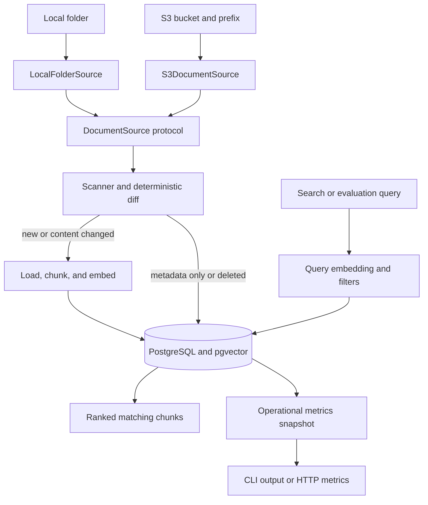

# ragpipe

<!-- Documentation includes schema revisions through 0005. -->

`ragpipe` is the data pipeline underneath a retrieval-augmented generation (RAG) system. It keeps PostgreSQL and pgvector synchronized with changing PDF, Markdown, and text documents from a local folder or Amazon S3. It detects additions, content changes, metadata changes, and deletions using deterministic SHA-256 hashes, then embeds only the chunks that actually need new vectors.

> Everyone builds the chatbot on top. This project builds the pipeline underneath—the part that must stay correct when a document changes, disappears, or thousands arrive overnight.

## What is implemented

- Recursive local-folder discovery for `.pdf`, `.md`, `.markdown`, and `.txt`; document symlinks are ignored
- A `DocumentSource` protocol that separates synchronization from source-specific scanning and loading
- A tested `LocalFolderSource` implementation with source-root path protection
- A paginated `S3DocumentSource` implementation with strict URI parsing and object consistency checks
- SHA-256 content and metadata change detection instead of unreliable modification timestamps
- Optional per-document metadata through `.ragpipe-metadata.json`
- Metadata-only updates without deleting chunks or regenerating embeddings
- Recursive character chunking with configurable size and overlap
- A provider interface plus local `sentence-transformers/all-MiniLM-L6-v2` embeddings
- PostgreSQL document state and pgvector embeddings with foreign-key cascade deletion
- One atomic database transaction per synchronization with rollback on failure
- Persisted, bounded, credential-sanitized failed-run information
- Idempotent no-op synchronization for unchanged files
- PostgreSQL advisory locking that rejects overlapping synchronization runs
- `ragpipe sync`, `ragpipe search`, `ragpipe evaluate`, `ragpipe runs`, `ragpipe metrics`, `ragpipe serve-metrics`, and `ragpipe status` commands
- Cosine-similarity retrieval with embedding-model and JSONB metadata filtering
- Deterministic result ordering for equal similarity scores
- PostgreSQL HNSW cosine index for vector search
- PostgreSQL GIN index for document-metadata containment filters
- JSONL retrieval evaluation with Hit Rate@K, MRR@K, and per-query ranks
- Structured JSON logs, persisted synchronization statistics, source-volume metrics, and embedding timings
- Recent operational run history with successful and sanitized failed-run details
- Prometheus text export and a lightweight HTTP `/metrics` endpoint backed by persisted database aggregates
- Unit and pgvector integration tests covering synchronization, metadata, rollback, locking, migrations, search, and evaluation
- Docker Compose, package metadata, linting, type checking, coverage enforcement, builds, and GitHub Actions CI

Chat/answer generation, a web UI, authentication, authorization, and multi-tenancy are intentionally outside the current scope.

## Architecture



`SyncPipeline` depends on the `DocumentSource` protocol instead of directly depending on a filesystem path or cloud SDK. A source supplies a stable label, scans its current documents, and loads document text when required. `LocalFolderSource` and `S3DocumentSource` reuse the same diff, chunking, embedding, transaction, and observability logic.

The scanner compares the current source with the document state stored in PostgreSQL. The synchronization pipeline then applies the calculated changes inside one database transaction.

| Detected state | Database action | Generate embeddings? |
| --- | --- | ---: |
| New document | Insert document and chunks | Yes |
| Content changed | Replace the document and its chunks | Yes |
| Metadata only changed | Update the existing document row | No |
| Document deleted | Delete the document; chunks cascade | No |
| Unchanged | No document or chunk write | No |

A changed path's old document cascades to all old chunks before its replacement is inserted. Any loader, chunking, embedding, or database failure rolls back the complete corpus change.

Search embeds the query with the configured model and compares it only with chunks created by the same model. Evaluation sends expected query-to-document matches through that same retrieval path.

## Quick start

Requirements:

- Docker with Compose
- Python 3.12 or newer
- Enough disk and RAM to download and run the local embedding model

```bash
cp .env.example .env
docker compose up -d
python -m venv .venv
source .venv/bin/activate
pip install -e '.[local,dev]'
alembic upgrade head
ragpipe sync --source ./sample_docs
ragpipe sync --source ./sample_docs
ragpipe status
ragpipe search \
  --query "What is Ragpipe?" \
  --limit 5
ragpipe search \
  --query "What is Ragpipe?" \
  --metadata '{"department":"engineering"}'
ragpipe evaluate \
  --dataset evaluation/sample.jsonl \
  --k 5
ragpipe runs --limit 10
ragpipe metrics
```

The second unchanged synchronization should report:

```json
{
  "unchanged_documents": 1,
  "embedded_chunks": 0,
  "metadata_changed_documents": 0
}
```

To demonstrate content updates, edit `sample_docs/welcome.md` and synchronize again. Only that document should be embedded. Delete the document and its corresponding manifest entry, then synchronize again to remove its document row and vectors.

The local embedding model is downloaded on first use and then loaded from the local Hugging Face cache. An optional `HF_TOKEN` environment variable enables authenticated downloads and higher rate limits. Never commit that token.

## Amazon S3 source

Install the optional S3 dependency together with the local embedding and development dependencies:

```bash
pip install -e '.[local,s3,dev]'
```

Synchronize a complete bucket or one prefix:

```bash
ragpipe sync --source s3://my-document-bucket

ragpipe sync \
  --source s3://my-document-bucket/knowledge-base
```

S3 credentials are resolved through the standard AWS SDK credential chain, including environment variables, shared AWS profiles, container credentials, and instance or workload roles. Do not place access keys in the source URI or commit credentials to the repository. You can verify the active identity separately when the AWS CLI is installed:

```bash
aws sts get-caller-identity
```

The principal used by Ragpipe requires `s3:ListBucket` for the selected bucket and `s3:GetObject` for objects under the selected prefix. Production policies should restrict both resources and prefixes to the smallest required scope.

For each synchronization, the S3 implementation:

- Uses the `ListObjectsV2` paginator so corpora larger than one response page are discovered completely.
- Ignores directory markers and unsupported file extensions.
- Treats object keys relative to the selected prefix as stable document paths.
- Loads `.ragpipe-metadata.json` from the root of the selected bucket or prefix when present.
- Reads every supported object and calculates its exact SHA-256 content hash.
- Uses the listed ETag as an `If-Match` condition when reading an object.
- Verifies the SHA-256 hash again when loading changed content, failing safely if an object changed after scanning.

An S3 error is handled through the same synchronization failure path as a local scanning or loading error. Corpus changes are rolled back, and the failed run is recorded with a bounded, sanitized error message.

## Configuration

All Ragpipe settings use the `RAGPIPE_` prefix and can be placed in `.env`.

| Setting | Default | Purpose |
| --- | ---: | --- |
| `RAGPIPE_DATABASE_URL` | Local `ragpipe` PostgreSQL | psycopg connection URL |
| `RAGPIPE_EMBEDDING_MODEL` | `sentence-transformers/all-MiniLM-L6-v2` | Embedding model |
| `RAGPIPE_EMBEDDING_DIMENSION` | `384` | pgvector dimension; must match the model |
| `RAGPIPE_CHUNK_SIZE` | `800` | Maximum target characters per chunk |
| `RAGPIPE_CHUNK_OVERLAP` | `120` | Context repeated across adjacent chunks |
| `RAGPIPE_BATCH_SIZE` | `64` | Texts passed to the embedder per call |
| `RAGPIPE_LOG_LEVEL` | `INFO` | Structured logging threshold |

Changing the embedding model or dimension requires explicitly rebuilding or migrating the stored corpus. Vectors produced by different models belong to different embedding spaces and are not directly comparable.

For production, use a secret manager for database credentials, restrict network access, enable TLS, back up PostgreSQL, and pin container image digests.

## Document metadata

Place an optional `.ragpipe-metadata.json` file at the root of the selected local directory or S3 prefix. Its keys are document paths relative to that root or prefix, and every value must be a JSON object.

```json
{
  "welcome.md": {
    "department": "engineering",
    "tags": ["demo", "rag"],
    "access_groups": ["developers"]
  },
  "handbook/leave.md": {
    "department": "hr",
    "region": "india",
    "tags": ["policy", "leave"]
  }
}
```

The manifest itself is configuration and is not ingested as a document.

Manifest validation is intentionally strict:

- The manifest must not exceed 1 MiB.
- For local sources, the manifest must be a regular, non-symlink file.
- Its root value must be a JSON object.
- Every key must be a safe POSIX-style relative path.
- Absolute paths, parent traversal such as `../`, and unsupported paths are rejected.
- Every manifest path must refer to a supported document discovered in the same source.
- Every document's metadata must be a JSON object.
- Metadata is canonically serialized before hashing, so changing JSON key order does not create a false update.

If a document is deleted, remove its manifest entry in the same change. A stale entry referencing a missing document causes synchronization to fail safely.

When only metadata changes, Ragpipe updates `documents.metadata` and `documents.metadata_hash` without replacing the document, deleting chunks, or calling the embedding provider. The synchronization result reports the change separately:

```json
{
  "changed_documents": 0,
  "metadata_changed_documents": 1,
  "embedded_chunks": 0,
  "deleted_chunks": 0
}
```

## Vector search

Search the synchronized corpus without adding an LLM or chatbot layer:

```bash
ragpipe search \
  --query "How are document updates handled?" \
  --limit 5
```

Each result contains:

- Document path
- Chunk index
- Chunk content
- Merged document and chunk metadata
- Embedding model
- Cosine-similarity score

Higher scores indicate closer vector similarity. A score is a ranking signal, not a probability or confidence percentage.

Search only compares chunks produced by the configured embedding model. The result limit must be between `1` and `100`.

The schema provides an HNSW index using `vector_cosine_ops` for scalable approximate nearest-neighbor search. PostgreSQL may choose an exact sequential scan for very small corpora.

Search can run while synchronization is in progress. PostgreSQL transaction isolation ensures it sees the last committed corpus rather than a partial update.

### Metadata filters

Pass a JSON object to `--metadata` or `-m`:

```bash
ragpipe search \
  --query "leave policy" \
  --limit 5 \
  --metadata '{"department":"hr"}'
```

Multiple fields can be required together:

```bash
ragpipe search \
  --query "leave policy" \
  --metadata '{"department":"hr","region":"india"}'
```

PostgreSQL JSONB containment is used, so array containment is supported:

```bash
ragpipe search \
  --query "leave policy" \
  --metadata '{"tags":["leave"]}'
```

The filter must be valid JSON and its top-level value must be an object. Arrays, strings, numbers, booleans, `null`, `NaN`, and infinity values are rejected as top-level filters. An empty object matches all document metadata.

Document metadata is merged with internal chunk metadata in each result. If both contain the same key, chunk metadata takes precedence. Avoid document metadata keys reserved for chunk-level information, such as `chunk_index`.

The `documents_metadata_gin_idx` GIN index supports JSONB containment filtering.

> Metadata filtering is not authentication or authorization. An application handling protected documents must authenticate the caller, derive allowed filters from trusted identity data, enforce them server-side, and fail closed. Do not allow a caller to select their own `access_groups` value and treat that as access control.

## Retrieval evaluation

Ragpipe can measure whether search retrieves an expected document for a set of test queries.

Evaluation datasets use JSON Lines format with one case per line:

```json
{"query": "What does the demo document demonstrate?", "expected_document": "welcome.md"}
{"query": "What should happen after editing a document?", "expected_document": "welcome.md"}
```

`expected_document` must exactly match the document path relative to the synchronized source root.

Run an evaluation:

```bash
ragpipe evaluate \
  --dataset evaluation/sample.jsonl \
  --k 5
```

The report includes:

- `total_cases`: number of evaluated queries
- `hits`: queries where the expected document appeared
- `hit_rate_at_k`: fraction of queries with the expected document in the top K chunks
- `mean_reciprocal_rank_at_k`: average reciprocal rank of the first matching chunk
- Per-query retrieved paths, rank, reciprocal rank, and hit status

If the expected document appears first, its reciprocal rank is `1.0`; second is `0.5`; absent from the top K is `0.0`.

Queries are embedded in batches using `RAGPIPE_BATCH_SIZE`, then searched independently. The included sample is a smoke test, not a meaningful production benchmark. A useful evaluation corpus should contain multiple documents, varied queries, difficult negatives, and expected documents at different ranks.

## Database migrations

Alembic is the only owner of the Ragpipe PostgreSQL schema. The application validates the installed revision and vector dimension during startup but never creates or changes tables automatically.

Apply pending migrations before running the application:

```bash
alembic upgrade head
```

Inspect migration state:

```bash
alembic current
alembic heads
alembic history
```

Relevant revisions:

| Revision | Purpose |
| --- | --- |
| `0001_initial_schema` | Documents, chunks, sync runs, and pgvector schema |
| `0002_vector_search_index` | HNSW cosine index for vector retrieval |
| `0003_document_metadata` | Document metadata, metadata hashes, and metadata-change statistics |
| `0004_document_metadata_index` | GIN `jsonb_path_ops` index for metadata containment filters |
| `0005_operational_metrics` | Source-volume metrics, embedding timings, and recent-run index |

The application currently requires `0005_operational_metrics` at startup.

## Concurrent synchronization

Ragpipe uses a PostgreSQL advisory lock to allow only one synchronization per database at a time. This prevents overlapping cron jobs or deployments from reading the same corpus state and applying conflicting changes.

A rejected concurrent attempt exits with code `3`. It does not scan documents, generate embeddings, modify the corpus, or create a failed-run record. The lock is automatically released when synchronization finishes or its PostgreSQL session closes, so an orchestrator can retry later.

Search and evaluation do not acquire this lock because they only read the last committed corpus.

## Failure handling

Document, metadata, and vector changes are committed atomically. If scanning, loading, chunking, embedding, or database writing fails, the synchronization transaction is rolled back.

A separate failed-run record is then stored with a bounded, credential-sanitized error message. This preserves operational visibility without leaving a partially updated corpus.

Search and evaluation errors are returned as structured JSON and do not modify the corpus.

## Operational metrics and run history

Every synchronization records both its corpus outcome and operational measurements in `sync_runs`:

- `scanned_documents`: supported source documents observed during scanning
- `scanned_bytes`: combined byte size of those documents
- `embedding_batches`: embedding-provider calls attempted during the run
- `embedding_duration_ms`: cumulative wall-clock time spent in embedding-provider calls
- `duration_ms`: total run duration derived from `started_at` and `finished_at`
- New, content-changed, metadata-changed, deleted, and unchanged document counts
- Embedded and deleted chunk counts
- Final status and a bounded, credential-sanitized failure message

View the newest runs without writing SQL:

```bash
ragpipe runs --limit 10
```

The limit must be between `1` and `100`. Results are ordered by completion time from newest to oldest. The `sync_runs_finished_at_idx` index supports this query.

For failed runs, `embedded_chunks` and `deleted_chunks` describe committed changes and therefore remain zero after rollback. `embedding_batches` and `embedding_duration_ms` describe attempted work and may be greater than zero. This distinction prevents rolled-back changes from being reported as committed while preserving useful failure diagnostics.

Rows created before migration `0005_operational_metrics` are retained and backfilled with zero for the newly introduced metrics. Those zeros mean the measurements were unavailable for historical runs, not necessarily that no scanning occurred.

The local embedding provider does not incur API charges, so Ragpipe does not invent a cost metric. A future billable provider can add token and provider-reported cost usage without changing the meaning of the current timing counters.

## Prometheus metrics

Print one Prometheus snapshot directly to standard output:

```bash
ragpipe metrics
```

Start the HTTP exporter on its default loopback address and port:

```bash
ragpipe serve-metrics
```

The equivalent explicit command is:

```bash
ragpipe serve-metrics \
  --host 127.0.0.1 \
  --port 9464
```

Scrape the endpoint from another terminal:

```bash
curl http://127.0.0.1:9464/metrics
```

The server returns Prometheus text exposition format at `GET /metrics`. Other paths and non-GET requests return `404`. Press `Ctrl+C` to stop the server cleanly.

| Metric | Type | Meaning |
| --- | --- | --- |
| `ragpipe_documents` | Gauge | Documents currently stored |
| `ragpipe_chunks` | Gauge | Chunks currently stored |
| `ragpipe_sync_runs_total{status}` | Counter | Persisted runs grouped by `running`, `succeeded`, or `failed` |
| `ragpipe_document_changes_total{change}` | Counter | New, content-changed, metadata-changed, deleted, and unchanged documents across runs |
| `ragpipe_embedded_chunks_total` | Counter | Chunks committed with embeddings across runs |
| `ragpipe_deleted_chunks_total` | Counter | Chunks deleted by successful synchronizations |
| `ragpipe_scanned_documents_total` | Counter | Documents scanned across persisted runs |
| `ragpipe_scanned_bytes_total` | Counter | Document bytes scanned across persisted runs |
| `ragpipe_embedding_batches_total` | Counter | Embedding calls attempted across runs |
| `ragpipe_embedding_duration_seconds_total` | Counter | Cumulative time spent in attempted embedding calls |
| `ragpipe_last_sync_status{status}` | Gauge | One-hot status of the latest run |
| `ragpipe_last_sync_timestamp_seconds` | Gauge | Unix timestamp of the latest completed run |
| `ragpipe_last_sync_duration_seconds` | Gauge | Duration of the latest run |

Totals are calculated from `sync_runs`, so they survive process restarts and do not depend on one long-running Python process. Corpus gauges are calculated from the current `documents` and `chunks` tables. The exporter intentionally avoids `source` and `run_id` labels because their continuously growing values would create high-cardinality Prometheus time series.

Rows created before migration `0005_operational_metrics` contribute zero to fields that were unavailable historically. Failed runs may contribute attempted embedding batches and duration, while committed embedded/deleted chunk counters remain zero after rollback.

Example Prometheus configuration when Prometheus runs on the same host:

```yaml
scrape_configs:
  - job_name: ragpipe
    scrape_interval: 15s
    static_configs:
      - targets: ["127.0.0.1:9464"]
```

The exporter binds to `127.0.0.1` by default and has no authentication. Keep that default for local monitoring. If remote Prometheus access is required, bind deliberately, restrict network access, and place authentication and TLS at a trusted reverse proxy. Each scrape performs a read-only database aggregate query, so choose a sensible scrape interval.

## CLI exit codes

| Code | Meaning |
| ---: | --- |
| `0` | Command completed successfully |
| `1` | Synchronization, search, evaluation, metrics collection, or metrics serving failed |
| `2` | Schema is missing/outdated/incompatible, or command-line input is invalid |
| `3` | Another synchronization owns the database sync lock |
| `4` | Evaluation dataset content is invalid |

## Development and verification

```bash
make install
make check
make build
```

Equivalent direct checks include:

```bash
python -m ruff format --check .
python -m ruff check .
python -m mypy ragpipe
python -m pytest
python -m build
```

The test suite includes:

- `DocumentSource` integration, local-folder loading, and source-root path traversal protection
- S3 URI validation, pagination, filtering, metadata, exact hashing, consistency checks, and idempotency
- New, changed, metadata-changed, deleted, and unchanged detection
- Idempotent synchronization and metadata-only updates without re-embedding
- Changed-document replacement and deleted-document cleanup
- Transaction rollback and failed-run persistence
- Concurrent synchronization rejection
- Migration upgrade/downgrade and schema-revision validation
- HNSW and metadata GIN index verification
- Operational-metrics persistence, run ordering, limits, and failed-run semantics
- Database-backed operational aggregation, Prometheus rendering, HTTP responses, CLI output, and exporter cleanup
- Cosine ranking, model filtering, limits, and deterministic ordering
- JSONB object and array metadata containment filters
- Strict metadata manifest and CLI filter validation
- Evaluation JSONL validation, Hit Rate@K, MRR@K, and batched embeddings
- CLI output, resource cleanup, and exit codes

Integration tests require a disposable database whose name ends in `_test`:

```bash
export RAGPIPE_TEST_DATABASE_URL="postgresql://<user>:<password>@localhost:5432/ragpipe_test"
python -m pytest
```

The database-name guard prevents integration fixtures from resetting the development or production database.

## Extension points

Implement `EmbeddingProvider` to add another local model or an API provider such as OpenAI or Cohere. Implement `Chunker` to add semantic or document-aware splitting.

Implement `DocumentSource` to add another document system. A source must provide a stable label, return documents keyed by stable source-relative paths, and load extracted document text. `SyncPipeline` can then apply the existing change detection, metadata handling, chunking, embedding, transactional storage, and operational metrics without knowing where the documents originated.

`LocalFolderSource` and `S3DocumentSource` are currently available. Future releases can add other object stores, authenticated access-control enforcement, multi-source tenancy, evaluation-result persistence, provider-reported embedding cost, and OpenTelemetry export.

## Operational limitations

- The current version owns one database corpus and accepts one source per synchronization; multi-source tenancy is not implemented.
- Each synchronization treats its selected local root or S3 prefix as the complete corpus. Changing source locations against the same database can therefore add, replace, or delete existing documents.
- S3 scanning downloads every supported object to calculate an exact SHA-256 hash. New or changed objects are downloaded again for extraction. This favors correctness and bounded memory over minimum S3 request and transfer cost.
- Alembic migrations must be applied before running a newer application version.
- Empty documents are tracked but create no chunks.
- Scanned paths are relative to the local root or S3 prefix; moving a file or object is modeled as deletion plus addition.
- A manifest entry must refer to an existing supported document; remove stale entries when deleting documents.
- Synchronizations are serialized through a database advisory lock; rejected attempts must be retried.
- HNSW search is approximate and optimized for scalable nearest-neighbor retrieval.
- Metadata filtering narrows retrieval but does not authenticate users or enforce authorization.
- Search returns stored chunk content directly; do not expose it to untrusted callers without an authorization layer.
- Evaluation reports are printed as JSON and are not persisted.
- Evaluation cases do not currently accept metadata filters.
- Prometheus metrics are served by a lightweight single-process WSGI endpoint; authentication, TLS, service supervision, and Prometheus deployment are external responsibilities.
- OpenTelemetry export is not yet implemented.
- Changing the embedding model does not automatically re-embed unchanged documents.

## License

MIT
